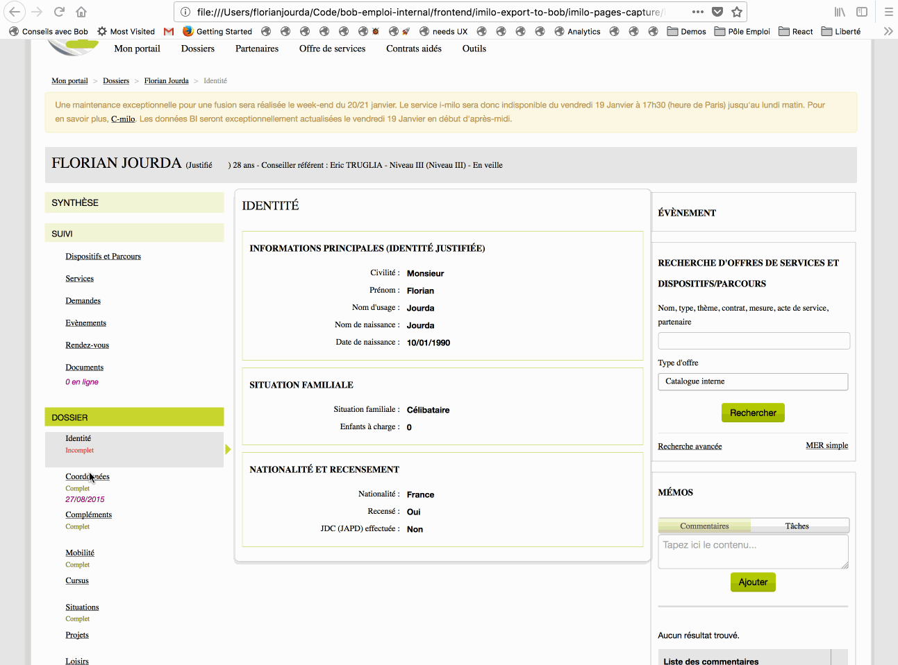

# Bookmarlet to import user data from i-milo to Bob in order to generate advices.

i-milo is the web CRM system of the Missions Locales, where they record the profile and situation
of the young people they help. We created a way to import data from the i-milo webpages.

## How to install the bookmarklet
TODO(florian): create a page to allow counselors to drag and drop the bookmarklet to their bookmark
and then get rid of import-from-imilo-bookmarlet.js and of the exception in .eslintignore.
bar, and fix the url of the script loaded in the bookmarlet to work on all environments.
Create a new bookmark on your browser. Name it 'Conseils avec Bob' and use the content of
`import-from-imilo-bookmarlet.js` as the URL of the bookmark.

## How to manually test
The folder `testdata/` contains captures of the i-milo page about a fake user
'Florian Jourda'. Open of of those pages and click on the bookmarlet to run the import to Bob.
This will show a modal telling what data will be sent from i-milo to Bob. Then clicking on the
modal confirmation button will open a new advices page on Bob. Note: this will *not* create a user
on Bob, advices are just computed on the fly but not saved.

